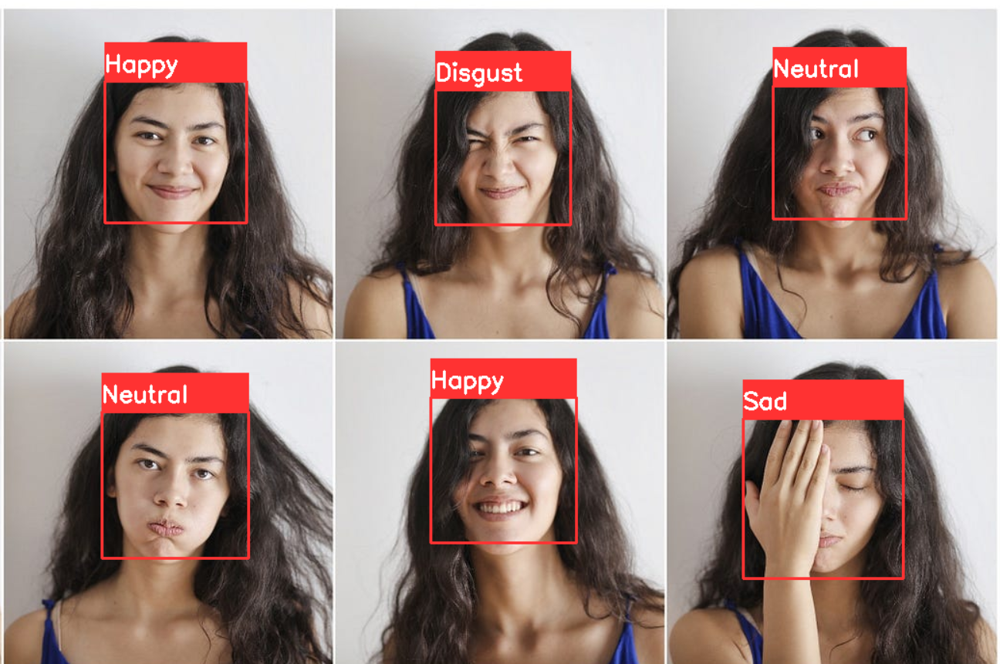

# Facial Emotion Recognition Using Deep Learning

This project implements a deep learning-based facial emotion recognition system. Using a trained Convolutional Neural Network (CNN), it classifies emotions from grayscale images of human faces into one of seven categories: Angry, Disgust, Fear, Happy, Neutral, Sad, and Surprise.

## Table of Contents
- [Features](#features)
- [Requirements](#requirements)
- [Installation](#installation)
- [Usage](#usage)
- [Project Structure](#project-structure)
- [Dataset](#dataset)
- [Model](#model)
- [Output](#ouput)
---

## Features
- Real-time emotion detection using the webcam.
- Emotion classification into seven categories.
- Pre-trained model for efficient and accurate predictions.

---

## Requirements
Ensure you have the following installed on your system:
- Python 3.7 or higher
- Libraries:
  - OpenCV
  - NumPy
  - Keras
  - TensorFlow
  - Google colab

Install the required dependencies using:
```bash
pip install opencv-python numpy keras tensorflow
```

---

## Installation
1. Clone the repository:
   ```bash
   git clone https://github.com/your-username/emotion-recognition.git
   cd emotion-recognition
   ```

2. Download the required files:
   - **Haar Cascade Classifier**: [haarcascade_frontalface_default.xml](https://github.com/opencv/opencv/blob/master/data/haarcascades/haarcascade_frontalface_default.xml)
   - **Pre-trained Model**: Ensure `model_file_30epochs.h5` is in the project directory.

3. Place these files in the project directory:
   ```
   emotion-recognition/
   ├── haarcascade_frontalface_default.xml
   ├── model_file_30epochs.h5
   ├── test.py
   ├── testdata.py
   ├── main.py
   └── ...
   ```

---

## Usage
### 1. Real-time Emotion Detection
Run the `test.py` file to detect emotions in real time using your webcam:
```bash
python test.py
```

### 2. Emotion Detection on Static Images
Run the `testdata.py` file to classify emotions in an image:
```bash
python testdata.py
```

### 3. Training a New Model (Optional)
Run the `main.py` file to train a new model on your dataset:
```bash
python main.py
```

---

## Project Structure
```
emotion-recognition/
├── haarcascade_frontalface_default.xml  # Haar Cascade for face detection
├── model_file_30epochs.h5              # Pre-trained CNN model
├── main.py                             # Script to train the CNN
├── test.py                             # Real-time emotion detection
├── testdata.py                         # Static image emotion detection
├── data/                               # Dataset (if training a new model)
│   ├── train/
│   └── test/
└── README.md                           # Project documentation
```

---


## Dataset
This project uses a dataset of grayscale images of faces, categorized into seven emotion classes:
1. Angry
2. Disgust
3. Fear
4. Happy
5. Neutral
6. Sad
7. Surprise

You can replace the dataset under `data/train/` and `data/test/` to retrain the model with custom data.

### download FER2013 dataset
- from below link and put in data folder under your project directory
- https://www.kaggle.com/msambare/fer2013
---

## Model
- The model is a Convolutional Neural Network (CNN) trained for 30 epochs on the dataset.
- Input shape: `(48, 48, 1)` (grayscale images resized to 48x48 pixels).
- Output: Probability distribution across seven emotion categories.
- Optimizer: Adam
- Loss Function: Categorical Crossentropy
---
## Output 
Below is a screenshot of the facial emotion recognition system in action. The system detects the emotion displayed by the person in front of the webcam and classifies it with a corresponding emotion label:

.


This updated version includes the `Facial Emotion Recognition Using Deep Learning.ipynb` file and instructions for using it with Jupyter Notebook.
